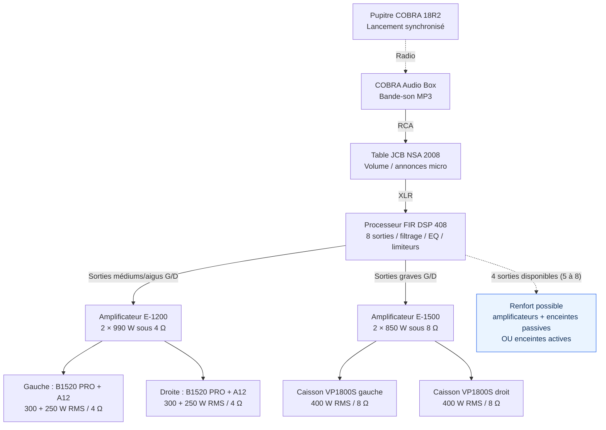

# Sonorisation — Feu d'artifice de Champigneulles 2026

**Association Pyrotechnique du Grand Est (PGE)**  
**Spectacle pyromusical : 6 décembre 2026**  
Document de travail — installation, couverture du public et besoins complémentaires.

> **Objet du dossier**  
> Présenter le matériel de sonorisation disponible, expliquer les limites de couverture et proposer un renfort adapté aux extrémités de la zone public.

## En un coup d'œil

| Installation actuelle | Valeur |
|---|---:|
| Enceintes passives | **6**, dont **2 caissons de basses 18″** |
| Amplificateurs | **2** |
| Puissance d'amplification annoncée | **3 680 W** |
| Puissance nominale des enceintes | **1 900 W RMS** |
| Processeur | **8 sorties**, dont **4 libres** |
| Zone public à couvrir | Environ **90–95 m × 15–23 m** (suivant le schéma) |

**Conclusion :** l'équipement existant est dimensionné pour la zone public représentée sur le plan de tir, mais pas pour sonoriser tout le parc. Un renfort de **2 à 4 enceintes** peut améliorer la répartition sonore, notamment aux extrémités.

### Sommaire

1. [Installation et cheminement audio](#1-installation-et-cheminement-audio)
2. [Implantation sur le site](#2-implantation-sur-le-site)
3. [Matériel disponible](#3-matériel-disponible)
4. [Puissance et couverture](#4-puissance-et-couverture)
5. [Scénarios d'extension](#5-scénarios-dextension)
6. [Matériel recherché et logistique](#6-matériel-recherché-et-logistique)
7. [Points à valider](#7-points-à-valider)

---

## 1. Installation et cheminement audio

La **COBRA Audio Box** lit la bande-son MP3 et est synchronisée par radio avec le pupitre de tir. Le signal passe ensuite par la table de mixage, puis par le processeur numérique qui répartit les graves et les médiums/aigus vers les amplificateurs.



> Les **4 sorties libres** du processeur ne sont **pas des sorties amplifiées** : elles permettent de piloter des enceintes actives ou des amplificateurs supplémentaires. Leur affectation doit être programmée et testée.

## 2. Implantation sur le site

Les emplacements sont **indicatifs** : ils doivent être confirmés avec le plan de tir, les distances de sécurité, le cheminement des câbles et les contraintes réelles du terrain. Les enceintes sont prévues côté tir, environ 1 à 2 m devant la barrière, hors des cercles de 30 m liés au tir bas calibre.

### Configuration actuelle — 3 points de diffusion

```text
                         ZONE DE TIR (hors public)

      OUEST                                                 EST
       [B1520]        [2 caissons + 2 × A12]             [B1520]
          │                      │                           │
  ────────┴──────────────────────┴───────────────────────────┴────  BARRIÈRE
        ↘   ↘                ↙  ↓  ↘                      ↙   ↙

                     ZONE PUBLIC ~ 90–95 m
                       profondeur ~ 15–23 m
```

Les **deux caissons sont regroupés au centre** afin de renforcer les graves, plutôt que de les disperser. Les **A12**, montées sur mâts, sont orientées l'une vers l'ouest et l'autre vers l'est. Les B1520 assurent la diffusion sur les côtés.

### Configuration étendue — 7 points de diffusion

```text
                         ZONE DE TIR (hors public)

 OUEST                                                              EST
 [P1]   [B1520]   [P2]   [2 subs + 2 A12]   [P3]   [B1520]   [P4]
   │       │       │            │            │       │       │
 ──┴───────┴───────┴────────────┴────────────┴───────┴───────┴──  BARRIÈRE
   ↘       ↘       ↘       ↙ ↓ ↘            ↙       ↙       ↙

                           ZONE PUBLIC

 P1 à P4 : enceintes supplémentaires (positions indicatives)
```

**Principe :** deux amplificateurs stéréo supplémentaires alimenteraient chacun **deux enceintes passives de 8 Ω** ; chaque enceinte bénéficierait d'une sortie dédiée du DSP, avec niveau et égalisation propres. Le document initial prévoit une diffusion sur la même ligne, sans retard a priori. **Ce point sera à vérifier sur site** en fonction des distances et des orientations réelles.

---

## 3. Matériel disponible

### Traitement et amplification

| Équipement | Qté | Fonction | Donnée principale |
|---|---:|---|---|
| the box pro **Amprack MK II** | 1 | Rack mobile | Processeur + 2 amplificateurs ; 230 V |
| the t.racks **FIR DSP 408** | 1 | Filtrage, EQ, limiteurs, routage | 4 entrées / **8 sorties XLR** ; 4 utilisées |
| the t.amp **E-1200** | 1 | Médiums / aigus | **2 × 990 W sous 4 Ω** ; 2 × 680 W sous 8 Ω |
| the t.amp **E-1500** | 1 | Graves | **2 × 850 W sous 8 Ω** ; 2 × 1 220 W sous 4 Ω |

### Diffusion

| Enceintes | Qté | Puissance unitaire | Impédance | Implantation |
|---|---:|---:|---:|---|
| Behringer **Eurolive B1520 PRO** (15″ + 1,75″) | 2 | **300 W RMS** | 8 Ω | Trépieds, côtés |
| Audiophony **A12** (3 voies, 12″) | 2 | **250 W RMS** | 8 Ω | Mâts, au centre |
| Behringer **Eurolive VP1800S** (18″) | 2 | **400 W RMS** | 8 Ω | Au sol, regroupés au centre |

### Commande et accessoires

| Équipement | Qté | Utilisation |
|---|---:|---|
| **COBRA Audio Box** | 1 | Lecture MP3 synchronisée avec le pupitre |
| Table **JCB NSA 2008** | 1 | Volume général et micro d'annonce (6 voies) |
| **Behringer Xenyx 302USB** | 1 | Table de mixage de secours (5 voies) |
| Trépieds et mâts | 4 | Mise en hauteur, embase 35 mm |

<details>
<summary><strong>Caractéristiques complémentaires des enceintes</strong></summary>

- **B1520 PRO** : 1 200 W crête ; sensibilité 96 dB (1 W / 1 m) ; 27 kg.
- **Audiophony A12** : 500 W crête ; sensibilité 99 dB (1 W / 1 m) ; 14 kg.
- **VP1800S** : 1 600 W crête ; sensibilité 100 dB (1 W / 1 m) ; 40–200 Hz ; 41 kg.
- Le rack comporte des connexions XLR et Speakon (System / Top / Sub).

</details>

---

## 4. Puissance et couverture

### Répartition de la puissance

| Circuit | Puissance ampli | Puissance enceintes | Ratio |
|---|---:|---:|---:|
| Médiums / aigus (2 canaux, 4 Ω) | **1 980 W** | **1 100 W RMS** | **× 1,8** |
| Graves (2 canaux, 8 Ω) | **1 700 W** | **800 W RMS** | **× 2,1** |
| **Total** | **3 680 W** | **1 900 W RMS** | **≈ × 1,9** |

Cette marge de puissance est celle retenue dans le dossier technique. Elle ne garantit pas, à elle seule, l'absence de dommage : **filtrage, limiteurs et réglage des niveaux restent indispensables**.

### Niveau sonore théorique en fonction de la distance

Estimation issue du document initial pour **une B1520 à pleine puissance, en champ libre**. Ce ne sont **pas des mesures réalisées sur le site**.

| Distance | Niveau max estimé | Lecture pratique |
|---|---:|---|
| 5 m | **107 dB** | Très élevé, à éviter pour le premier rang |
| 10 m | **101 dB** | Niveau de concert |
| 20–25 m | **93–95 dB** | Musique bien présente |
| 50 m | **87 dB** | Audibilité réduite pendant les détonations |
| 100 m | **81 dB** | Fond sonore |

Le dossier retient une baisse approximative de **6 dB à chaque doublement de distance** et mentionne une incertitude théorique de **± 3 dB**. En pratique, humidité, arbres, foule et configuration du terrain peuvent influer sur le résultat.

**Cible indiquée dans le dossier :** environ **95 dB au milieu du public**. La vérification des niveaux sonores et des exigences réglementaires applicables devra être faite sur site.

---

## 5. Scénarios d'extension

Le processeur FIR DSP 408 dispose de **4 sorties XLR supplémentaires**. Deux voies d'extension sont envisageables :

| | **Option A — enceintes actives** | **Option B — enceintes passives (préférée)** |
|---|---|---|
| Matériel | 2 à 4 enceintes amplifiées, 12″ ou 15″ | 2 à 4 enceintes passives 8 Ω + 1 ou 2 amplis stéréo |
| Liaison audio | XLR depuis le DSP | XLR vers amplis, puis Speakon vers enceintes |
| Alimentation 230 V | À proximité de **chaque enceinte** | Au niveau des **amplificateurs** |
| Avantage | Pas d'amplificateur externe à prévoir | Centralisation de l'amplification |
| Contrainte | Alimentation électrique distribuée | Amplis et câbles supplémentaires |

**Préférence du dossier : option B**, permettant de conserver une architecture d'amplification centralisée et d'étendre la couverture aux extrémités.

Les sorties **5 à 8**, accessibles à l'arrière du processeur dans le rack, nécessitent une configuration dédiée. Les nouveaux éléments devront être préparés et testés **avant le jour du spectacle**, si du matériel est prêté.

---

## 6. Matériel recherché et logistique

### Prêt recherché auprès de la commune ou d'un partenaire

**Option B — prioritaire**

- [ ] **1 ou 2 amplificateurs stéréo**, au moins **2 × 500 W sous 8 Ω** chacun.
- [ ] **2 ou 4 enceintes passives 8 Ω**.
- [ ] **1 câble Speakon par enceinte** (25 à 50 m, selon implantation).
- [ ] **Protection contre la pluie** pour le matériel.

**Option A — alternative**

- [ ] **2 à 4 enceintes actives** de 12″ ou 15″, avec leurs pieds.
- [ ] **1 câble XLR par enceinte** (25 à 50 m).
- [ ] **230 V à chaque emplacement** d'enceinte active.
- [ ] **Protection contre la pluie** pour le matériel.

### Conditions d'installation

| Besoin | Prévision |
|---|---|
| **Électricité** | 1 prise dédiée **230 V / 16 A** pour le rack, sans buvette ni chauffage sur la même ligne ; seconde ligne si ajout d'amplis |
| **Accès véhicule** | Déchargement au plus près (caissons de **41 kg**, B1520 de **27 kg**) |
| **Hauteur** | Enceintes à **2,5–3 m**, sous réserve de validation du plan de sécurité |
| **Essai sonore** | Environ **30 minutes** avant la tombée de la nuit |
| **Météo** | Housses de pluie pour les enceintes et rack couvert |

---

## 7. Points à valider

- [ ] Vérifier les emplacements exacts des points de diffusion sur le **plan de sécurité**.
- [ ] Confirmer la disponibilité et les caractéristiques du matériel prêté.
- [ ] Vérifier les longueurs de câbles, passages et protections mécaniques.
- [ ] Préparer le routage DSP, les filtrages et les limiteurs.
- [ ] Valider les délais éventuels entre enceintes lors de l'essai sur site.
- [ ] Mesurer et ajuster les niveaux sonores dans la zone public.
- [ ] Vérifier les exigences réglementaires applicables à cette manifestation.

---

<sub>Source : dossier « Sonorisation – Feu d'artifice de Champigneulles 2026 », version du 7 octobre 2026. Schémas simplifiés et indicatifs ; aucune implantation définitive n'est validée dans ce README.</sub>