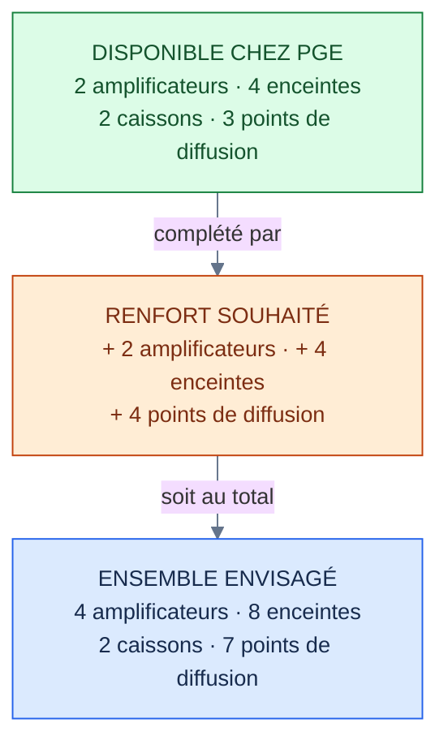
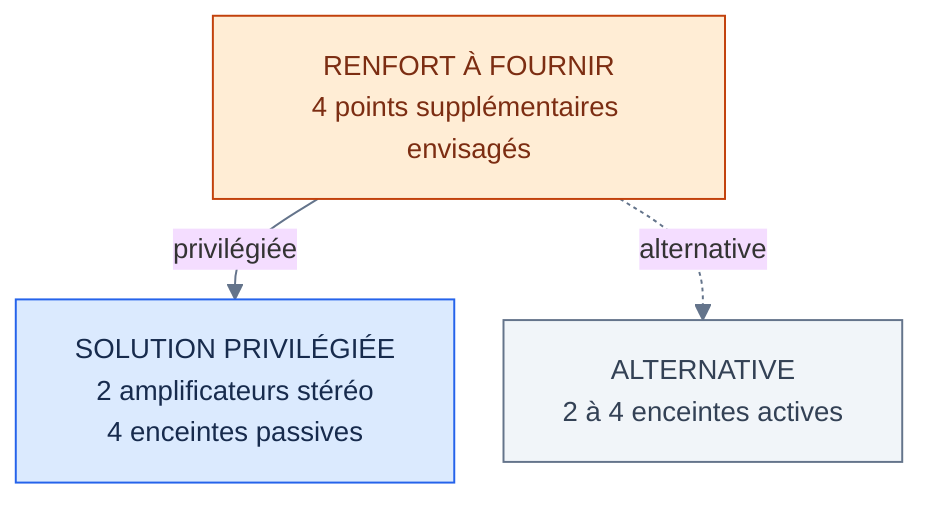

# Sonorisation — Champigneulles 2026

**Association Pyrotechnique du Grand Est (PGE)** · Spectacle pyromusical du **6 décembre 2026**

L'association possède une installation de sonorisation complète. D'après les estimations réalisées à partir du plan de tir, elle devrait couvrir la zone de public prévue, mais avec une diffusion moins régulière aux extrémités.

Pour le spectacle demandé par la commune, **nous souhaitons ajouter 2 amplificateurs et 4 enceintes passives**. Le matériel actuel serait conservé.

## 1. Bilan

*Légende : **vert** — matériel disponible chez PGE ; **orange** — matériel souhaité en complément ; **bleu** — configuration totale envisagée. Les flèches indiquent la composition du système, pas le trajet du son.*

| Donnée | Estimation |
|---|---|
| Zone de public | Environ **90 × 20 m** |
| Couverture avec le matériel PGE | Adaptée en théorie à cette zone |
| Point le moins favorable | Extrémité ouest |
| Au-delà de 40 à 50 m des enceintes | Musique moins présente, surtout pendant les détonations |
| Apport attendu du renfort | Répartition sonore plus homogène |

Les valeurs de couverture sont **théoriques** : elles ne remplacent pas un essai sur place. Le système n'est pas dimensionné pour sonoriser l'ensemble du parc.

## 2. Matériel disponible chez PGE

| Matériel | Modèle | Qté |
|---|---|---:|
| Rack | THE BOX PRO AMPRACK MK II | 1 |
| Processeur audio | THE T.RACKS FIR DSP 408 | 1 |
| Amplificateurs | THE T.AMP E-1200 / E-1500 | 2 |
| Enceintes principales | BEHRINGER EUROLIVE B1520 PRO | 2 |
| Enceintes d'appoint | AUDIOPHONY A12 | 2 |
| Caissons de basses | BEHRINGER EUROLIVE VP1800S | 2 |
| Lecture synchronisée | COBRA AUDIO BOX | 1 |
| Tables de mixage | JCB NSA 2008 / BEHRINGER XENYX 302USB | 2 |
| Trépieds et mâts | Embase 35 mm | 4 |

La puissance cumulée annoncée est de **3 680 W** pour les amplificateurs et de **1 900 W RMS** pour les enceintes. Il s'agit de caractéristiques du matériel, pas d'une mesure du niveau sonore.

<strong>Caractéristiques techniques du matériel</strong>

### TRAITEMENT ET AMPLIFICATION

| Équipement | Caractéristiques |
|---|---|
| THE BOX PRO AMPRACK MK II | Rack mobile, 230 V ; entrées et renvois XLR ; sorties Speakon System / Top / Sub |
| THE T.RACKS FIR DSP 408 | 4 entrées, 8 sorties XLR ; filtres FIR, égalisation, routage, limiteurs ; **4 sorties libres** |
| THE T.AMP E-1200 | **2 × 990 W / 4 Ω** ; 2 × 680 W / 8 Ω ; classe H |
| THE T.AMP E-1500 | **2 × 850 W / 8 Ω** ; 2 × 1 220 W / 4 Ω ; classe H |

### ENCEINTES PASSIVES

| Modèle | Qté | Puissance RMS | Impédance |
|---|---:|---:|---:|
| BEHRINGER EUROLIVE B1520 PRO | 2 | **300 W** | 8 Ω |
| AUDIOPHONY A12 | 2 | **250 W** | 8 Ω |
| BEHRINGER EUROLIVE VP1800S | 2 | **400 W** | 8 Ω |

| Modèle | Caractéristiques complémentaires |
|---|---|
| B1520 PRO | 15″ + 1,75″ ; 1 200 W crête ; 96 dB (1 W / 1 m) ; 27 kg |
| A12 | 3 voies, 12″ ; 500 W crête ; 99 dB (1 W / 1 m) ; 14 kg |
| VP1800S | Caisson 18″ ; 40–200 Hz ; 1 600 W crête ; 100 dB (1 W / 1 m) ; 41 kg |

### COMMANDE ET ACCESSOIRES

| Équipement | Fonction |
|---|---|
| COBRA AUDIO BOX | Lecture MP3 sur clé USB, synchronisation radio avec le pupitre ; sorties casque, RCA et jack 6,35 mm |
| JCB NSA 2008 | Table principale, 6 voies dont 1 micro ; volume et annonces |
| BEHRINGER XENYX 302USB | Table de secours, 5 voies |
| Trépieds et mâts | 4 supports ; embase de 35 mm |

<strong>Schéma et branchements audio</strong>

La musique est lancée par la **COBRA AUDIO BOX**, synchronisée par radio avec le pupitre de tir COBRA 18R2.

~~~mermaid
%%{init: {"flowchart": {"nodeSpacing": 22, "rankSpacing": 30, "htmlLabels": false}, "theme": "base", "themeVariables": {"fontSize": "13px", "lineColor": "#64748b"}}}%%
flowchart TB
  A["Pupitre COBRA 18R2"]
  B["COBRA AUDIO BOX"]
  C["Mixage · JCB NSA 2008"]
  D["Traitement · FIR DSP 408"]
  E["E-1200 · médiums et aigus"]
  F["E-1500 · graves"]
  G["2 B1520 PRO + 2 A12"]
  H["2 caissons VP1800S"]
  A -. "Radio" .-> B
  B --> C --> D
  D --> E --> G
  D --> F --> H
  classDef source fill:#f1f5f9,stroke:#64748b,color:#172b4d;
  classDef amp fill:#dbeafe,stroke:#2563eb,color:#172b4d;
  classDef speaker fill:#ecfdf5,stroke:#059669,color:#14532d;
  class A,B,C source;
  class D,E,F amp;
  class G,H speaker;
~~~

*Légende : **gris** — sources et mixage ; **bleu** — traitement et amplification ; **vert** — enceintes. **Flèche pleine** : trajet du signal audio ; **flèche pointillée** : synchronisation radio.*

| Circuit | Branchement |
|---|---|
| E-1200, canal gauche | 1 B1520 PRO + 1 A12 en parallèle (4 Ω) |
| E-1200, canal droit | 1 B1520 PRO + 1 A12 en parallèle (4 Ω) |
| E-1500 | 1 VP1800S par canal (8 Ω) |
| FIR DSP 408 | 4 sorties utilisées ; **sorties 5 à 8 disponibles** |

Les sorties libres du DSP sont des **sorties de signal XLR** : elles ne peuvent pas alimenter directement des enceintes passives.

## 3. Couverture du public

| Paramètre | Valeur retenue |
|---|---|
| Zone considérée | 90 à 95 m de long ; 15 à 23 m de profondeur |
| Implantation actuelle | **3 points de diffusion** : ouest, centre, est |
| Distance enceinte-public | Moins de 25 m pour la plupart des positions prévues |
| Caissons de basses | 2 regroupés au centre |
| Zone moins bien couverte | Extrémité ouest |
| Sonorisation du parc entier | Non prévue |

<strong>Implantation actuelle et extension envisagée</strong>

Les points sont présentés d'**ouest en est**, verticalement pour éviter les débordements sur les petits écrans. Les traits indiquent leur succession, pas le câblage. Schémas **non à l'échelle**.

### Installation actuelle : 3 points

~~~mermaid
%%{init: {"flowchart": {"nodeSpacing": 25, "rankSpacing": 26, "htmlLabels": false}, "theme": "base", "themeVariables": {"fontSize": "13px"}}}%%
flowchart TB
  O["OUEST · B1520 PRO"]
  C["CENTRE · 2 VP1800S + 2 A12"]
  E["EST · B1520 PRO"]
  O --- C --- E
  classDef existing fill:#dcfce7,stroke:#15803d,color:#14532d;
  class O,C,E existing;
~~~

*Légende : **vert** — les 3 points de diffusion disponibles chez PGE. Le trait représente leur succession d'ouest en est et non un câble.*

### Avec renfort : 7 points

~~~mermaid
%%{init: {"flowchart": {"nodeSpacing": 18, "rankSpacing": 20, "htmlLabels": false}, "theme": "base", "themeVariables": {"fontSize": "13px"}}}%%
flowchart TB
  P1["P1 · renfort ouest"]
  O["B1520 PRO · ouest"]
  P2["P2 · renfort ouest"]
  C["CENTRE · 2 caissons + 2 A12"]
  P3["P3 · renfort est"]
  E["B1520 PRO · est"]
  P4["P4 · renfort est"]
  P1 --- O --- P2 --- C --- P3 --- E --- P4
  classDef existing fill:#dcfce7,stroke:#15803d,color:#14532d;
  classDef proposed fill:#ffedd5,stroke:#c2410c,color:#7c2d12;
  class O,C,E existing;
  class P1,P2,P3,P4 proposed;
~~~

*Légende : **vert** — points de diffusion existants ; **orange** — renforts envisagés (P1 à P4). Les traits indiquent la succession des emplacements, pas les liaisons audio. Positions indicatives, non à l'échelle.*

| Positionnement | Prévision |
|---|---|
| Enceintes | 1 à 2 m devant la barrière, côté tir |
| Zones de sécurité | Hors des cercles de 30 m liés au tir bas calibre |
| Hauteur | Environ 2,5 à 3 m, selon les supports |
| Deux caissons au centre | Couplage des graves ; gain théorique évoqué d'environ 6 dB |
| Deux A12 au centre | Orientées vers l'ouest et vers l'est |

L'implantation exacte devra être validée sur le plan de sécurité.

<strong>Estimations acoustiques et puissances</strong>

### Puissance nominale

| Circuit | Amplificateurs | Enceintes RMS | Ratio |
|---|---:|---:|---:|
| Médiums/aigus, 2 canaux à 4 Ω | 1 980 W | 1 100 W | × 1,8 |
| Graves, 2 canaux à 8 Ω | 1 700 W | 800 W | × 2,1 |
| **Total** | **3 680 W** | **1 900 W** | **≈ × 1,9** |

Ces ratios ne dispensent pas de régler correctement le filtrage, les limiteurs et les niveaux.

### Niveau théorique d'une B1520 PRO

*Estimation pour une enceinte à pleine puissance, en champ libre ; aucune mesure sur site.*

| Distance | Niveau estimé | Appréciation |
|---|---:|---|
| 5 m | 107 dB | Très élevé pour un premier rang |
| 10 m | 101 dB | Musique très présente |
| 20 à 25 m | 93 à 95 dB | Musique bien présente |
| 50 m | 87 dB | Risque de masquage par les détonations |
| 100 m | 81 dB | Fond sonore |

| Hypothèse du dossier initial | Valeur ou remarque |
|---|---|
| Perte avec la distance | Environ **6 dB** par doublement |
| Incertitude annoncée | **± 3 dB** |
| Contribution de plusieurs enceintes | Peut augmenter le niveau perçu |
| Cible envisagée au milieu du public | Environ **95 dB** |
| Influences extérieures | Foule, humidité, arbres, orientations |
| Référence réglementaire citée | Décret n° 2017-1244 ; 102 dB(A) sur 15 min dans le dossier initial |

La référence réglementaire citée dans le dossier ne suffit pas à établir le régime applicable à cette manifestation. Les niveaux et obligations devront être vérifiés sur place.

## 4. Matériel complémentaire souhaité

*Légende : **orange** — besoin de renfort ; **bleu** — solution privilégiée ; **gris** — alternative. Trait plein : option privilégiée ; pointillé : autre possibilité. Les quantités et raccordements sont détaillés ci-dessous.*

### Solution privilégiée : enceintes passives

| Matériel à obtenir | Quantité | Caractéristiques |
|---|---:|---|
| Amplificateurs stéréo | **2** | Au moins 2 × 500 W sous 8 Ω chacun |
| Enceintes passives | **4** | 8 Ω, avec supports |
| Câbles Speakon | 4 | 1 par enceinte ; 25 à 50 m envisagés |
| Câbles XLR | Selon implantation | DSP vers amplificateurs |
| Protections pluie | Selon implantation | Amplificateurs et enceintes |

**Un prêt partiel de 1 amplificateur et 2 enceintes** reste possible.

### Autre possibilité : enceintes actives

| Matériel à obtenir | Quantité | Caractéristiques |
|---|---:|---|
| Enceintes actives | 2 à 4 | 12″ ou 15″, avec pieds |
| Câbles XLR | 1 par enceinte | 25 à 50 m envisagés |
| Alimentation 230 V | 1 par enceinte | À chaque emplacement |
| Protections pluie | Selon implantation | Matériel installé à l'extérieur |

<strong>Comparatif et configuration des renforts</strong>

| Point | Passives (privilégiées) | Actives |
|---|---|---|
| Amplification | 1 ou 2 amplis stéréo externes | Intégrée |
| Audio depuis le DSP | XLR vers amplis | XLR vers enceintes |
| Liaison aux enceintes | Speakon | Pas de câble haut-parleur |
| Secteur 230 V | Près des amplificateurs | Près de chaque enceinte |
| Diffusion possible | 2 à 4 enceintes | 2 à 4 enceintes |

Le **FIR DSP 408** dispose de quatre sorties XLR libres (5 à 8). Chaque renfort peut avoir son propre niveau, son égalisation, ses filtres et un retard ajustable.

Dans la configuration passive complète, chaque amplificateur ajouté alimente **deux enceintes de 8 Ω**, une par canal. Le dossier prévoit une même ligne de diffusion, sans retard a priori ; ce point sera confirmé lors des essais selon les distances et les orientations. La configuration DSP devra être préparée avant le spectacle si le matériel de prêt est disponible.

## 5. Conditions d'installation

| Besoin | Prévision |
|---|---|
| Alimentation du rack | **230 V / 16 A**, ligne dédiée sans buvette ni chauffage |
| Si ajout d'amplificateurs | Seconde ligne électrique adaptée |
| Accès véhicule | Déchargement au plus près |
| Manutention | Caissons de 41 kg ; B1520 PRO de 27 kg |
| Hauteur des enceintes | **2,5 à 3 m**, selon validation de l'implantation |
| Essai sonore | Environ **30 min** avant la tombée de la nuit |
| Protection météo | Rack couvert, housses et protections adaptées |

<strong>Vérifications avant le spectacle</strong>

- [ ] Confirmer les emplacements avec le plan de tir et les distances de sécurité.
- [ ] Vérifier la disponibilité et la compatibilité du matériel prêté.
- [ ] Prévoir la longueur, le passage et la protection des câbles.
- [ ] Vérifier les alimentations et les protections contre la pluie.
- [ ] Régler les sorties du DSP, les filtres et les limiteurs.
- [ ] Ajuster les niveaux, la couverture et les éventuels retards sur place.
- [ ] Vérifier les niveaux sonores et la réglementation applicable.

---

*Document de travail établi à partir du dossier PGE du 7 octobre 2026. Puissances et caractéristiques reprises du dossier initial ; implantations et niveaux acoustiques à confirmer sur place.*

[Conventions de rédaction](docs/conventions-redaction.md)
