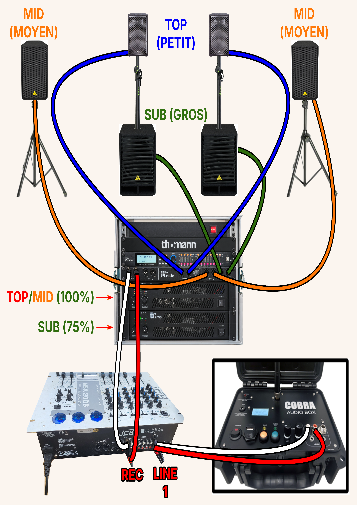

# Sonorisation — Champigneulles 2026

**Association Pyrotechnique du Grand Est (PGE)** · **Spectacle pyromusical du 6 décembre 2026**

Dossier technique de l'installation PGE, des contraintes de diffusion sur le site de Champigneulles et de la solution envisagée.

## Sommaire

1. **[Notre installation — matériel PGE](#1-notre-installation--matériel-pge)**
   - [Vue d'ensemble du matériel et des câbles](#vue-densemble--matériel-et-câblage)
   - [Schéma et branchements audio](#schéma-et-branchements-audio)
2. **[La problématique — sonorisation du public](#2-la-problématique--sonorisation-du-public)**
   - [Plan de l'implantation actuelle](#implantation-actuelle)
3. **[La solution — renforcer la diffusion](#3-la-solution--renforcer-la-diffusion)**
   - [Répartition du matériel et du prêt](#répartition-du-matériel-et-du-prêt)
   - [Plan de l'implantation envisagée](#implantation-envisagée)
4. **[Conditions d'installation — sécurité et logistique](#4-conditions-dinstallation--sécurité-et-logistique)**
   - [Conditions à prévoir sur site](#conditions-à-prévoir-sur-site)
   - [Vérifications techniques avant le spectacle](#vérifications-techniques-avant-le-spectacle--pge)

> **Notre demande en bref**
>
> Pour le spectacle du **6 décembre 2026**, PGE recherche le prêt de **4 enceintes passives de 8 Ω avec supports** et de **2 amplificateurs stéréo** (au moins 2 × 500 W sous 8 Ω chacun), en complément de son installation.
>
> **Prêt partiel possible :** 2 enceintes et 1 amplificateur. **Câbles et protections météo :** fourniture à confirmer.

---

## 1. Notre installation — matériel PGE

<strong>Afficher le matériel et les branchements</strong>

Le dispositif existant comprend **2 amplificateurs**, **4 enceintes de diffusion** et **2 caissons de graves**, répartis sur **3 points de diffusion**.

### Vue d'ensemble — matériel et câblage

### Schéma et branchements audio

La musique est lancée par la **COBRA AUDIO BOX**, synchronisée avec le **poste de tir COBRA 18R2**.

~~~mermaid
%%{init: {"flowchart": {"useMaxWidth": true, "nodeSpacing": 5, "rankSpacing": 24, "padding": 6, "htmlLabels": true, "wrappingWidth": 260}, "theme": "base", "themeVariables": {"fontSize": "14px", "lineColor": "#64748b"}}}%%
flowchart TB
  A["<b>COMMANDE</b> Poste de tir COBRA 18R2"]
  B["<b>LECTURE AUDIO</b> Bande-son MP3 COBRA AUDIO BOX"]
  C["<b>MIXAGE</b> Table principale JCB NSA 2008"]
  D["<b>TRAITEMENT</b> Processeur audio THE T.RACKS FIR DSP 408"]
  E["<b>AMPLIFICATEURS</b> Médiums et aigus THE T.AMP E-1200 2 × 990 W / 4 Ω"]
  F["<b>AMPLIFICATEURS</b> Graves THE T.AMP E-1500 2 × 850 W / 8 Ω"]
  LG["<b>CANAL GAUCHE</b> 4 Ω"]
  LD["<b>CANAL DROIT</b> 4 Ω"]
  FG["<b>CANAL GAUCHE</b> 8 Ω"]
  FD["<b>CANAL DROIT</b> 8 Ω"]
  BG["<b>ENCEINTE MÉDIUMS/AIGUS</b> 2 voies · 15″ · gauche BEHRINGER EUROLIVE B1520 PRO 300 W RMS"]
  BD["<b>ENCEINTE MÉDIUMS/AIGUS</b> 2 voies · 15″ · droite BEHRINGER EUROLIVE B1520 PRO 300 W RMS"]
  AG["<b>ENCEINTE MÉDIUMS/AIGUS</b> 3 voies · 12″ · gauche AUDIOPHONY A12 250 W RMS"]
  AD["<b>ENCEINTE MÉDIUMS/AIGUS</b> 3 voies · 12″ · droite AUDIOPHONY A12 250 W RMS"]
  SG["<b>ENCEINTE GRAVES</b> 18″ · gauche BEHRINGER EUROLIVE VP1800S 400 W RMS"]
  SD["<b>ENCEINTE GRAVES</b> 18″ · droite BEHRINGER EUROLIVE VP1800S 400 W RMS"]

  TG["<b>TRÉPIED AU SOL</b>"]
  TD["<b>TRÉPIED AU SOL</b>"]
  MG["<b>MÂT DE COUPLAGE</b>"]
  MD["<b>MÂT DE COUPLAGE</b>"]

  A -. "Télécommunications radio (antenne)" .-> B
  B -. "RCA → LINE 1" .-> C
  C -. "REC OUT → INPUT" .-> D
  D -. "XLR" .-> E
  D -. "XLR" .-> F
  E -.-> LG
  E -.-> LD
  F -.-> FG
  F -.-> FD
  LG -. "SYSTEM OUT L" .-> BG
  LG -. "TOP OUT L" .-> AG
  LD -. "SYSTEM OUT R" .-> BD
  LD -. "TOP OUT R" .-> AD
  FG -. "SUB OUT L" .-> SG
  FD -. "SUB OUT R" .-> SD

  BG --- TG
  BD --- TD
  SG --- MG
  SD --- MD

  classDef commande fill:#f1f5f9,stroke:#64748b,color:#172b4d;
  classDef processeur fill:#ffedd5,stroke:#d97706,color:#7c2d12;
  classDef amplis fill:#dbeafe,stroke:#2563eb,color:#172b4d;
  classDef canaux fill:#e2e8f0,stroke:#94a3b8,color:#334155;
  classDef principales fill:#ccfbf1,stroke:#0f766e,color:#134e4a;
  classDef appoint fill:#ecfccb,stroke:#65a30d,color:#365314;
  classDef basses fill:#f3e8ff,stroke:#9333ea,color:#581c87;
  classDef support fill:#f8fafc,stroke:#94a3b8,color:#334155;
  class A,B,C commande;
  class D processeur;
  class E,F amplis;
  class LG,LD,FG,FD canaux;
  class BG,BD principales;
  class AG,AD appoint;
  class SG,SD basses;
  class TG,TD,MG,MD support;
~~~

~~~mermaid
%%{init: {"flowchart": {"diagramPadding": 0, "padding": 5, "htmlLabels": true, "wrappingWidth": 360}, "theme": "base", "themeVariables": {"fontSize": "11px"}}}%%
flowchart LR
  LIBRE["<b>4 SORTIES XLR LIBRES</b> DSP 408 · sorties 5 à 8 2 à 4 enceintes amplifiées ou ampli + enceintes passives"]
  classDef reserve fill:#eff6ff,stroke:#3b82f6,stroke-width:1px,stroke-dasharray:4 3,color:#1e40af;
  class LIBRE reserve;
~~~

**Puissances cumulées :** amplificateurs **3 680 W annoncés** · enceintes **1 900 W RMS**. Cette réserve de puissance exige des réglages adaptés des filtres et limiteurs.

Le matériel comprend également un rack **THE BOX PRO AMPRACK MK II**.

🔹 Fiche technique complète — matériel, puissances et raccordements

<table>
<thead>
<tr><th align="left" width="33%" nowrap="nowrap">Équipement</th><th width="7%" nowrap="nowrap">Qté</th><th align="left" width="25%" nowrap="nowrap">Puissance / Ω</th><th align="left" width="35%" nowrap="nowrap">Détails&nbsp;techniques</th></tr>
</thead>
<tbody>
<tr><th colspan="4" align="left">═══ ⚪ COMMANDE ET MIXAGE ═══</th></tr>
<tr><td nowrap="nowrap">COBRA&nbsp;18R2</td><td align="center">1</td><td>—</td><td>Poste de tir Synchronisation radio ↔ COBRA&nbsp;AUDIO&nbsp;BOX</td></tr>
<tr><td nowrap="nowrap">COBRA&nbsp;AUDIO&nbsp;BOX</td><td align="center">1</td><td>—</td><td>Lecture MP3 sur clé USB Sortie casque Sorties RCA et jack&nbsp;6,35&nbsp;mm</td></tr>
<tr><td nowrap="nowrap">JCB&nbsp;NSA&nbsp;2008</td><td align="center">1</td><td>—</td><td>Mixage principal 6 voies (dont 1 micro) Volume et annonces</td></tr>
<tr><td nowrap="nowrap">BEHRINGER&nbsp;XENYX&nbsp;302USB</td><td align="center">1</td><td>—</td><td>Table de mixage de secours 5 voies</td></tr>
<tr><th colspan="4" align="left">═══ 🟠 TRAITEMENT AUDIO ═══</th></tr>
<tr><td nowrap="nowrap">THE&nbsp;T.RACKS&nbsp;FIR&nbsp;DSP&nbsp;408</td><td align="center">1</td><td>—</td><td>4 entrées 8 sorties XLR Traitements : filtres FIR, égalisation, routage, limiteurs 4 sorties utilisées <strong>Sorties 5 à 8 disponibles</strong> Signal non amplifié → amplificateur ou enceinte active</td></tr>
<tr><th colspan="4" align="left">═══ 🔵 AMPLIFICATION ET RACK ═══</th></tr>
<tr><td nowrap="nowrap">THE&nbsp;T.AMP&nbsp;E-1200</td><td align="center">1</td><td><strong>2&nbsp;×&nbsp;990&nbsp;W&nbsp;/&#8288;&nbsp;4&nbsp;Ω</strong> 2&nbsp;×&nbsp;680&nbsp;W&nbsp;/&#8288;&nbsp;8&nbsp;Ω</td><td>Amplification médiums/aigus Classe H</td></tr>
<tr><td nowrap="nowrap">THE&nbsp;T.AMP&nbsp;E-1500</td><td align="center">1</td><td><strong>2&nbsp;×&nbsp;850&nbsp;W&nbsp;/&#8288;&nbsp;8&nbsp;Ω</strong> 2&nbsp;×&nbsp;1&nbsp;220&nbsp;W&nbsp;/&#8288;&nbsp;4&nbsp;Ω</td><td>Amplification graves Classe H</td></tr>
<tr><td nowrap="nowrap">THE&nbsp;BOX&nbsp;PRO&nbsp;AMPRACK&nbsp;MK&nbsp;II</td><td align="center">1</td><td>230 V</td><td>Rack mobile Entrées et renvois XLR Sorties Speakon : System / Top / Sub</td></tr>
<tr><th colspan="4" align="left">═══ 🟢 ENCEINTES PASSIVES ═══</th></tr>
<tr><td nowrap="nowrap">🟩&nbsp;BEHRINGER&nbsp;EUROLIVE&nbsp;B1520&nbsp;PRO</td><td align="center">2</td><td><strong>300&nbsp;W&nbsp;RMS&nbsp;/&#8288;&nbsp;8&nbsp;Ω</strong> chacune</td><td>2 voies 15″ + moteur d'aigus&nbsp;1,75″ 1&nbsp;200&nbsp;W crête 96&nbsp;dB&nbsp;(1&nbsp;W&nbsp;/&#8288;&nbsp;1&nbsp;m) 27&nbsp;kg</td></tr>
<tr><td nowrap="nowrap">🟨&nbsp;AUDIOPHONY&nbsp;A12</td><td align="center">2</td><td><strong>250&nbsp;W&nbsp;RMS&nbsp;/&#8288;&nbsp;8&nbsp;Ω</strong> chacune</td><td>3 voies Haut-parleur de 12″ 500&nbsp;W crête 99&nbsp;dB&nbsp;(1&nbsp;W&nbsp;/&#8288;&nbsp;1&nbsp;m) 14&nbsp;kg</td></tr>
<tr><td nowrap="nowrap">🟪&nbsp;BEHRINGER&nbsp;EUROLIVE&nbsp;VP1800S</td><td align="center">2</td><td><strong>400&nbsp;W&nbsp;RMS&nbsp;/&#8288;&nbsp;8&nbsp;Ω</strong> chacun</td><td>Caisson 18″ Bande passante : 40–200&nbsp;Hz 1&nbsp;600&nbsp;W crête 100&nbsp;dB&nbsp;(1&nbsp;W&nbsp;/&#8288;&nbsp;1&nbsp;m) 41&nbsp;kg</td></tr>
<tr><th colspan="4" align="left">═══ ⚙️ RACCORDEMENTS ET SUPPORTS ═══</th></tr>
<tr><td nowrap="nowrap">E-1200&nbsp;—&nbsp;gauche&nbsp;/&nbsp;droit</td><td align="center">2 canaux</td><td><strong>4&nbsp;Ω&nbsp;/&#8288;&nbsp;canal</strong></td><td>SYSTEM OUT L/R → B1520 PRO (TOP) TOP OUT L/R → A12 (MID) 1 de chaque en parallèle par canal</td></tr>
<tr><td nowrap="nowrap">E-1500&nbsp;—&nbsp;gauche&nbsp;/&nbsp;droit</td><td align="center">2 canaux</td><td><strong>8&nbsp;Ω&nbsp;/&#8288;&nbsp;canal</strong></td><td>SUB OUT L/R → VP1800S (SUB) 1 caisson par canal</td></tr>
<tr><td nowrap="nowrap">Trépied&nbsp;au&nbsp;sol</td><td align="center">2</td><td>—</td><td>Support indépendant Pour B1520 PRO (15″)</td></tr>
<tr><td nowrap="nowrap">Mât&nbsp;de&nbsp;couplage</td><td align="center">2</td><td>35 mm</td><td>Inséré dans l'embase du VP1800S Porte l'A12 (12″)</td></tr>
</tbody>
</table>

**Précision :** les B1520 PRO et A12 sont des enceintes large bande, exploitées ici pour les médiums/aigus selon les filtres du DSP. [B1520 PRO : constructeur](https://www.behringer.com/en/products/0313-AAM) · [A12 : fiche technique Audiofanzine](https://fr.audiofanzine.com/enceinte-sono-full-range/audiophony/A12/).

## 2. La problématique — sonorisation du public

D'après le plan de tir, la plupart des spectateurs de la zone prévue seraient à **moins de 25 m d'une enceinte**. Notre installation semble adaptée à ce périmètre, mais la diffusion pourrait être **moins régulière aux extrémités**, particulièrement à l'ouest. Le dispositif n'est pas destiné à sonoriser l'ensemble du parc.

### Implantation actuelle

## 3. La solution — renforcer la diffusion

Pour compléter les **3 points de diffusion existants** et mieux couvrir les extrémités du public, PGE souhaite mettre en place **4 points supplémentaires**.

### Répartition du matériel et du prêt

PGE conserve **sa sonorisation actuelle**. La demande porte sur le renfort ; la fourniture des câbles et des protections sera précisée avec le partenaire.

| Fourniture | Matériel | Quantité et caractéristiques |
|---|---|---|
| **PGE — existant** | Amplificateurs, enceintes, caissons et DSP | 2 amplificateurs, 4 enceintes de diffusion, 2 caissons de graves et 1 processeur audio |
| **Prêt sollicité** | Enceintes passives avec supports | **4**, 8 Ω |
| **Prêt sollicité** | Amplificateurs stéréo | **2**, au moins 2 × 500 W sous 8 Ω chacun |
| **À confirmer** | Câbles Speakon | **4**, un par enceinte ; longueurs envisagées de 25 à 50 m |
| **À confirmer** | Câbles XLR | Selon implantation ; DSP vers amplificateurs |
| **À confirmer** | Protections contre la pluie | Selon implantation ; matériel installé à l'extérieur |

En cas de prêt limité, **1 amplificateur et 2 enceintes** permettraient déjà d'ajouter deux points de diffusion.

### Implantation envisagée

Le renfort complète le matériel PGE, **sans remplacer les enceintes ni les caissons existants**.

*Implantation et angles de couverture indicatifs, à confirmer sur site.*

### Si du matériel actif est disponible

À défaut d'enceintes passives et d'amplificateurs, le prêt de **2 à 4 enceintes actives de 12″ ou 15″**, avec pieds, est également envisageable. Cette option demande un **câble XLR par enceinte** (25 à 50 m envisagés), une **alimentation 230 V à chaque emplacement** et une protection contre la pluie.

🔹 Raccordement et réglages — détails PGE

Le **THE T.RACKS FIR DSP 408** utilise actuellement **4 sorties sur 8**. Les **4 sorties XLR libres (5 à 8)**, accessibles à l'arrière du rack, permettraient d'ajouter le renfort après configuration du routage.

- **Enceintes passives :** DSP → XLR → amplificateurs → Speakon → enceintes. Chaque amplificateur stéréo alimente **2 enceintes de 8 Ω**, une par canal.
- **Enceintes actives :** DSP → XLR → enceintes, avec amplification et alimentation sur chaque point.
- **Réglages :** niveaux, égalisation, filtres et retard ajustables par sortie. Une même ligne de diffusion est envisagée, **sans retard a priori**, à confirmer sur place.

Si le prêt est confirmé suffisamment tôt, PGE préparera et testera les raccordements et les réglages **avant le spectacle**.

## 4. Conditions d'installation — sécurité et logistique

**L'implantation définitive doit être validée sur le plan de sécurité**, quel que soit le matériel retenu.

### Conditions à prévoir sur site

| Point à organiser | Conditions prévues |
|---|---|
| **Implantation et sécurité** | **Position :** 1 à 2 m devant la barrière, côté tir. **Distance de sécurité :** hors des cercles de 30 m liés au petit calibre. **Hauteur envisagée :** 2,5 à 3 m, sous réserve de validation. |
| **Électricité** | **Rack :** ligne dédiée 230 V / 16 A, sans buvette ni chauffage. **Renfort :** seconde ligne électrique adaptée si des amplificateurs sont ajoutés. |
| **Accès et manutention** | **Déchargement :** au plus près des emplacements. **Poids :** caissons de 41 kg ; B1520 PRO de 27 kg. |
| **Protection météo** | **Rack :** couvert. **Amplificateurs et enceintes :** protections adaptées contre la pluie. |
| **Essais sonores** | **Créneau :** environ 30 min avant la tombée de la nuit. **Objectif :** vérification de la diffusion et derniers réglages. |

### Vérifications techniques avant le spectacle — PGE

- [ ] Valider les emplacements, les distances de sécurité et la hauteur des supports.
- [ ] Confirmer le prêt et la compatibilité du matériel.
- [ ] Prévoir les longueurs, le passage et la protection des câbles.
- [ ] Vérifier les alimentations et les protections contre la pluie.
- [ ] Préparer les sorties DSP, les filtres et les limiteurs.
- [ ] Tester les niveaux, la couverture et les éventuels retards.
- [ ] Vérifier les niveaux sonores et la réglementation applicable.

---

*Document de travail établi à partir du dossier PGE du 7 octobre 2026. Puissances et caractéristiques reprises du dossier initial ; implantations et niveaux acoustiques à confirmer sur place.*

[Conventions de rédaction](docs/conventions-redaction.md)
